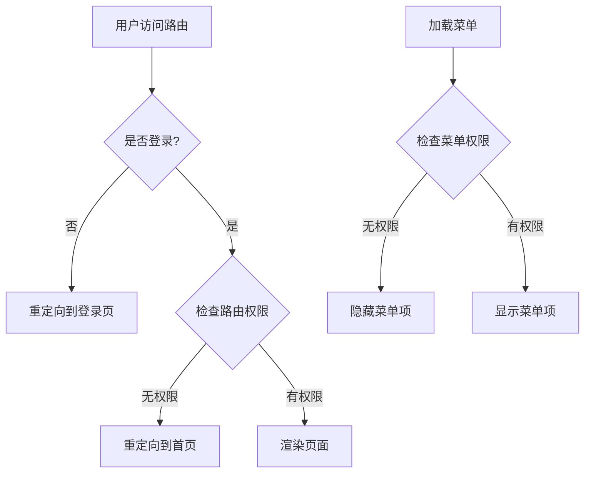

# 路由权限控制说明

## 概述

本项目实现了基于角色和权限的路由访问控制系统，确保用户只能访问其有权限的页面和功能。

## 核心概念

### 1. 用户角色 (UserRole)

系统定义了三种基本角色：

- **admin** - 管理员：拥有所有权限
- **developer** - 开发者：拥有开发相关权限
- **viewer** - 查看者：仅拥有查看权限

### 2. 用户权限 (UserPermission)

权限采用 `模块:操作` 的命名规范：

#### 仪表盘权限
- `dashboard:view` - 查看仪表盘

#### 服务管理权限
- `service:view` - 查看服务
- `service:create` - 创建服务
- `service:update` - 更新服务
- `service:delete` - 删除服务
- `service:control` - 控制服务（启停）

#### API 管理权限
- `api:view` - 查看 API
- `api:create` - 创建 API
- `api:update` - 更新 API
- `api:delete` - 删除 API

#### 用户管理权限
- `user:view` - 查看用户
- `user:create` - 创建用户
- `user:update` - 更新用户
- `user:delete` - 删除用户
- `user:role-manage` - 管理角色

#### 系统设置权限
- `setting:view` - 查看设置
- `setting:update` - 更新设置

## 架构设计

### 文件结构

```
src/
├── hooks/
│   └── user.store.ts          # 用户状态管理（包含角色和权限）
├── routes/
│   ├── index.tsx              # 路由配置
│   ├── permissions.ts         # 权限配置和检查函数
│   └── ProtectedRoute.tsx     # 路由守卫组件
└── pages/
    └── manager/
        └── components/
            └── ManagerLayout/
                └── ManagerLayout.tsx  # 菜单权限过滤
```

### 工作流程



## 使用方法

### 1. 在 User Store 中管理权限

```typescript
import { root } from '@/hooks';

const user = root.user;

// 检查是否有某个权限
if (user.hasPermission('service:view')) {
  // 执行操作
}

// 检查是否有某个角色
if (user.hasRole('admin')) {
  // 执行管理员操作
}

// 检查是否有任一权限
if (user.hasAnyPermission(['service:create', 'service:update'])) {
  // 执行操作
}

// 检查是否有所有权限
if (user.hasAllPermissions(['service:view', 'service:control'])) {
  // 执行操作
}
```

### 2. 配置路由权限

在 `routes/permissions.ts` 中添加路由权限配置：

```typescript
export const ROUTE_PERMISSIONS: Record<string, RoutePermissionConfig> = {
  '/manager/new-page': {
    path: '/manager/new-page',
    permissions: ['module:view'],
  },
};
```

### 3. 配置菜单权限

在 `routes/permissions.ts` 中添加菜单权限配置：

```typescript
export const MENU_PERMISSIONS: Record<string, UserPermission[]> = {
  'new-menu-item': ['module:view'],
};
```

### 4. 使用 ProtectedRoute 组件

路由已自动配置权限保护，无需额外操作：

```tsx
{
  path: '/manager/protected-page',
  element: (
    <ProtectedRoute>
      <YourComponent />
    </ProtectedRoute>
  ),
}
```

## 权限配置示例

### 示例 1：不同角色的菜单显示

```typescript
// Admin - 看到所有菜单
roles: ['admin']
permissions: ['dashboard:view', 'service:view', 'api:view', 'user:view', 'setting:view']

// Developer - 看到服务和 API 管理
roles: ['developer']
permissions: ['dashboard:view', 'service:view', 'api:view']

// Viewer - 只看到仪表盘
roles: ['viewer']
permissions: ['dashboard:view']
```

### 示例 2：细粒度权限控制

```typescript
// 只允许管理员访问用户管理
'/manager/users': {
  path: '/manager/users',
  permissions: ['user:view'],
  roles: ['admin'],  // 限制只有 admin 角色
}

// 需要多个权限才能访问
'/manager/advanced-settings': {
  path: '/manager/advanced-settings',
  permissions: ['setting:view', 'setting:update'],
  requireAll: true,  // 需要同时拥有两个权限
}
```

## 扩展指南

### 添加新权限

1. 在 `user.store.ts` 中添加新的权限类型：

```typescript
export type UserPermission = 
  | 'dashboard:view'
  | 'service:view'
  | 'your-module:view'  // 新增
  | 'your-module:create';  // 新增
```

2. 在 `permissions.ts` 中配置路由和菜单权限：

```typescript
export const ROUTE_PERMISSIONS = {
  '/manager/your-page': {
    path: '/manager/your-page',
    permissions: ['your-module:view'],
  },
};

export const MENU_PERMISSIONS = {
  'your-menu': ['your-module:view'],
};
```

### 自定义权限检查逻辑

修改 `user.store.ts` 中的权限检查方法：

```typescript
hasPermission(permission: UserPermission): boolean {
  // 自定义逻辑
  if (someCondition) {
    return true;
  }
  return store.permissions.includes(permission);
}
```

### 从后端获取权限

在实际应用中，权限应该从后端 API 获取：

```typescript
async function login(username: string, password: string) {
  const response = await authService.login({ username, password });
  
  // 从响应中获取权限
  store.roles = response.data.user.roles;
  store.permissions = response.data.user.permissions;
  store.isLoggedIn = true;
}
```

## 最佳实践

### 1. 权限命名规范

- 使用 `模块:操作` 格式
- 操作包括：view, create, update, delete, control, manage
- 保持命名一致性和可读性

### 2. 最小权限原则

- 默认不授予任何权限
- 只授予完成工作所需的最小权限集
- 定期审查和清理未使用的权限

### 3. 角色设计

- Admin: 系统管理员，拥有所有权限
- Developer: 开发者，拥有开发和测试权限
- Viewer: 查看者，仅有只读权限
- 根据业务需求可扩展更多角色

### 4. 前端权限 vs 后端权限

⚠️ **重要提示**：前端权限控制仅用于 UI 展示和用户体验优化，**不能替代后端权限验证**。

- ✅ 前端：隐藏无权限的菜单和按钮
- ✅ 前端：阻止无权限的路由访问
- ❌ 不要依赖前端权限进行安全控制
- ✅ 后端必须验证每个请求的权限

### 5. 性能优化

- 使用 `useMemo` 缓存权限检查结果
- 避免在渲染过程中频繁调用权限检查
- 权限数据应该在登录时一次性获取并缓存

## 常见问题

### Q1: 如何测试不同角色的权限？

修改 `user.store.ts` 中的 `login` 方法，模拟不同角色：

```typescript
login(username: string, password: string, role: UserRole = 'admin') {
  store.roles = [role];
  // 根据角色设置不同的权限
  if (role === 'viewer') {
    store.permissions = ['dashboard:view'];
  }
  // ...
}
```

### Q2: 如何实现动态权限？

从后端 API 获取用户权限并更新 store：

```typescript
async function loadUserPermissions() {
  const response = await api.getUserPermissions();
  store.permissions = response.data.permissions;
  notify(); // 通知状态更新
}
```

### Q3: 如何处理权限变更？

当用户权限发生变化时：

1. 更新 user store 中的权限数据
2. 调用 `notify()` 触发重新渲染
3. 菜单和路由会自动根据新权限更新

### Q4: 如何添加权限不足的提示页面？

创建一个新的无权限页面：

```tsx
// pages/Forbidden.tsx
export default function Forbidden() {
  return (
    <div>
      <h1>403 - 无权限访问</h1>
      <p>您没有权限访问此页面</p>
    </div>
  );
}
```

修改 `ProtectedRoute.tsx` 中的重定向逻辑。

## 总结

本权限系统提供了：

- ✅ 基于角色的访问控制 (RBAC)
- ✅ 细粒度的权限管理
- ✅ 路由级别的权限保护
- ✅ 菜单项的动态显示/隐藏
- ✅ 灵活的权限检查方法
- ✅ 易于扩展的架构

通过合理使用权限控制，可以提升用户体验并确保系统安全性。
